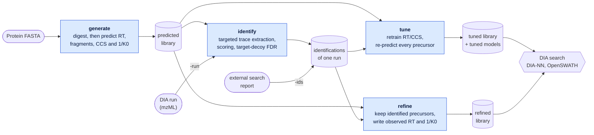

# DIALibGen

Generate, refine and tune DIA spectral libraries with one TOPP-compatible
executable. DIALibGen uses OpenMS and AlphaPeptDeep in C++; it needs no Python
runtime.

## Overview

A DIA search needs a spectral library: for every peptide precursor, the
retention time, fragment intensities and ion mobility to look for. DIALibGen
predicts such a library directly from a protein FASTA with the open
AlphaPeptDeep models, as a scriptable TOPP tool that records how each library
was made. It fills the role of a search engine's built-in predictor, outside
the search engine. DIALibGen can then adapt the library to one of your runs.
It finds confidently identified peptides in the run itself, by targeted trace
extraction and target-decoy error control (`-run`, experimental), or takes them
from an external search's report (`-ids`). `refine` writes the observed values
into the library. `tune` retrains the RT and CCS predictors on the run and
re-predicts the entire library, including the peptides that have not been
identified.



Blue boxes are the steps of the one DIALibGen executable; the rounded boxes are
your files and the hexagon is the search engine that uses the result.
Cylinders are what the steps produce. `identify` is not a mode of its own: it
runs inside `refine` and `tune` when they are given the raw run
(`-run run.mzML`), and its report is kept (`-out_ids`). Given an external
search's report instead (`-ids report.parquet`), they skip it. `-run` is
experimental, and until ion-mobility support lands it adapts retention time
only (`-tune_heads rt`, no `-write_im`). `tune` and `refine` can be used on
their own or combined: `-mode refine -tune` retrains and re-predicts the
library first and then writes the observed values, in one invocation; add
`-no_filter` to keep the precursors that were not identified. Models saved
with `-tune_out_models` can predict new libraries with `generate`. A predicted
library can also be searched as it is.

| Mode | Input | Result |
|---|---|---|
| `generate` (default) | Protein FASTA | Predicted RT, fragment intensities, CCS and 1/K0 derived from it |
| `refine` | Library, and one DIA run (`-run`, experimental) or that run's identification report (`-ids`) | Library filtered to identified precursors, with observed RT and optional mobility/intensities |
| `tune` | Library, and one DIA run (`-run`, experimental) or that run's identification report (`-ids`) | RT/CCS models adapted to that run, then predictions for the complete input library |

Version **0.11.0** incorporates library refinement and model training from
DIALibRefine. See [usage and migration](docs/usage.md),
[parameter reference](docs/parameters.md), [changes](CHANGELOG.md) and the
[backlog](BACKLOG.md).

## Install

Download the CLI archive or desktop installer for your platform from
[Releases](https://github.com/okohlbacher/DIALibGen/releases). Keep the archive's
`bin`, `lib` and `share` directories together. The CLI is one executable with
bundled runtime libraries, OpenMS data and the three prediction models.
Each platform's `DIALibGen-sources-<platform>.json` manifest lists its corresponding
dependency sources, recipes and patches. Large source archives are split into
numbered parts; [third-party notices](THIRD-PARTY-NOTICES.md#corresponding-sources)
explain how to reconstruct them. Runtime inventories and license texts are
included with the binaries.

```bash
curl -fsSLO https://github.com/okohlbacher/DIALibGen/releases/latest/download/DIALibGen-macos-arm64.tar.gz
tar xzf DIALibGen-macos-arm64.tar.gz
./bin/DIALibGen --help
```

On macOS, the [Homebrew tap](https://github.com/okohlbacher/homebrew-dialibrarygenerator)
also provides the CLI and desktop app:

```bash
brew install --cask okohlbacher/dialibrarygenerator/dialibgen-cli
brew install --cask okohlbacher/dialibrarygenerator/dialibgen
```

Signed 0.11.0 candidate `8cd1726` took between one and two seconds for its
first CLI launch on fresh hosted Macs (archive 2.0 s, Homebrew 0.8 s). Earlier
releases showed much longer delays. These observations do not guarantee startup
time on every Mac; the hashes and conditions are recorded in the
[macOS startup measurements](docs/testing.md#macos-startup).

## Usage

The commands below need DIALibGen **0.11.0 or later**; earlier releases have
neither `-mode` nor the `-generation:` options. Run `DIALibGen --helphelp` for
every option of your executable. The [usage guide](docs/usage.md) explains each
mode in depth; the [parameter reference](docs/parameters.md) lists all options.

| Task | Mode | Command |
|---|---|---|
| Predict a library from a FASTA | `generate` | `DIALibGen -in proteins.fasta -out predicted.tsv` |
| Write observed values into a library | `refine` | `DIALibGen -mode refine -in predicted.tsv -ids report.parquet -out refined.tsv` |
| Retrain RT/CCS on a run, re-predict the whole library | `tune` | `DIALibGen -mode tune -in predicted.tsv -ids report.parquet -out tuned.tsv` |
| Tune, then write observed values, in one call | `refine` with `-tune` | `DIALibGen -mode refine -tune -no_filter -in predicted.tsv -ids report.parquet -out adapted.tsv` |
| Tune on a raw run, no external search (experimental) | `tune` with `-run` | `DIALibGen -mode tune -tune_heads rt -in predicted.tsv -run run.mzML -out tuned.tsv` |

Existing output files are never overwritten. Options that belong to a different
mode are rejected when changed from their defaults.

### Examples

Generate a library for a timsTOF method, using up to 16 parallel inference
sessions:

```bash
DIALibGen -in proteins.fasta -out predicted.tsv \
  -generation:instrument timsTOF -threads 0
```

Match the digestion, modifications, charge and m/z ranges to the sample
preparation and acquisition. Defaults are Trypsin/P, one missed cleavage,
peptide lengths 7–30, precursor charges 1–4, precursor m/z 350–1200, fixed
Carbamidomethyl (C) and no decoys; the search engine creates its own decoys.

```bash
DIALibGen -in proteins.fasta -out predicted.parquet \
  -generation:precursor_charges 2 3 \
  -generation:variable_modifications 'Oxidation (M)' \
  -generation:missed_cleavages 2 \
  -generation:irt_rescale true
```

Keep a recipe and reuse it. Explicit command-line settings override the file:

```bash
DIALibGen -write_config generation.json
DIALibGen -in proteins.fasta -config generation.json -out predicted.tsv
```

A saved recipe fixes the NCE it resolved. When you change the instrument on
top of it, also pass `-generation:nce -1` (instrument default) or a value.

A complete cycle with DIA-NN 2: predict, search once, adapt to the run, search
again. `tune` and `refine` need a report of **one** run that carries protein
annotation, hence `--fasta ... --reannotate --met-excision` in the searches
(see [DIA-NN](#dia-nn)).

```bash
# 1. predict; DIA-NN reads the TSV form
DIALibGen -in proteins.fasta -out predicted.tsv -generation:instrument timsTOF -threads 0

# 2. first-pass search of one representative run
diann --f run01.d --lib predicted.tsv --fasta proteins.fasta --reannotate --met-excision \
      --out first_pass.parquet --threads 16

# 3a. adapt the predictors to the run and re-predict every precursor ...
DIALibGen -mode tune -in predicted.tsv -ids first_pass.parquet \
  -out tuned.tsv -tune_out_models tuned-models -machine:threads 8

# 3b. ... or keep only what was identified, with its observed RT and 1/K0 ...
DIALibGen -mode refine -in predicted.tsv -ids first_pass.parquet \
  -out refined.tsv -write_im -out_report residuals.tsv

# 3c. ... or both in one call: tune, re-predict every precursor, then write the observed values
DIALibGen -mode refine -tune -no_filter -in predicted.tsv -ids first_pass.parquet \
  -out adapted.tsv -write_im -machine:threads 8

# 4. final search: one --f per run (DIA-NN does not take a shell glob after a single --f)
diann --f run01.d --f run02.d --f run03.d --lib tuned.tsv \
      --fasta proteins.fasta --reannotate --met-excision --out final.parquet --threads 16
```

Which one? `tune` keeps the whole library and changes only its predicted RT and
ion mobility, so the final search tests the same hypotheses as the first.
`refine` without `-no_filter` shrinks the library to what the first search
identified. That makes the second search faster, but it also changes what its
error-rate estimate means, and precursors missed in the first pass stay missed.
Neither is guaranteed to improve a search; check on your own data. `refine`
applies precursor, global and protein q-value gates of 0.01 and stops when
nothing passes, which happens with very small libraries. `tune` needs several
hundred identified precursors. See the [usage guide](docs/usage.md) for
interpretation.

Tuned and observed retention times are in the reference run's minutes and are
specific to its gradient and method. Evaluate the transfer before using such a
library on a different method. The provenance sidecar (`*.refine.json`) records
quality gates, input fingerprints, residuals and, for tuning, each head's
recipe, cohorts, seed and model hashes.

Models saved with `-tune_out_models` can predict a new library later:

```bash
DIALibGen -in other.fasta -out other_adapted.tsv -generation:instrument timsTOF \
  -generation:rt_model tuned-models/peptdeep_rt_dynamic.onnx \
  -generation:ccs_model tuned-models/peptdeep_ccs_dynamic.onnx \
  -generation:free_cysteine_rt_correction false
```

This library's RT is the tuned model's normalized output, not minutes; only
`-mode tune` rescales to the reference run.

### Built-in identification (experimental)

With `-run`, `refine` and `tune` need no external search. DIALibGen finds
candidate precursors whose predicted fragments co-occur in the run's spectra,
extracts their traces with OpenSWATH (stock OpenMS), scores them with a
semi-supervised discriminant and keeps those that pass target-decoy error
control at 1 %. Decoys are built in memory; target and decoy are each
predicted from their own sequence, so the two compete on equal terms.

```bash
DIALibGen -mode tune -tune_heads rt -in predicted.parquet -run run.mzML -out tuned.tsv -threads 8
DIALibGen -mode refine -tune -tune_heads rt -no_filter -in predicted.parquet -run run.mzML -out adapted.tsv
```

- The run must be a centroided DIA mzML. For timsTOF diaPASEF, convert the
  `.d` with a converter that writes a per-peak 1/K0 array and valid mzML 1.1
  (`mzpeak-convert --to mzml`, from the release that includes its mzML fixes).
- The identifications are written to `<out>.ids.parquet` (`-out_ids`), in the
  columns an `-ids` report has, and can be reused with `-ids`.
- A diaPASEF run is searched with its ion mobility: the library's 1/K0 is
  calibrated to the run, each precursor is extracted from its one diaPASEF
  window within a 1/K0 window (`-search:im_window`, automatic by default), and
  the report carries each identification's observed 1/K0, measured at its
  elution apex over the window's whole 1/K0 range (a value read inside the
  1/K0 window would be pulled towards the prediction). `-tune_heads
  ccs|both` and `-write_im` therefore work with such a run; on a run without
  ion mobility (or with `-search:im_window -1`) they are refused before
  anything is searched. The CCS head is then tuned on the precursors the
  1/K0 window let through, which favours those the library already
  predicted well.
- Measured on an Orbitrap Astral and a timsTOF run: most identifications are
  also found by DIA-NN (95-97 %), and entrapment estimates the error at
  0.7-0.9 % at nominal 1 %. The option stays experimental until a screened
  entrapment test confirms this; see the
  [design document](docs/design/built-in-identification.md).

### Instruments

`-generation:instrument` and `-generation:nce` select the fragment-intensity
prediction. They do not change predicted RT or CCS. Names are case-insensitive;
spaces, hyphens, underscores, a leading `Orbitrap` and a trailing model number
are ignored, so `-generation:instrument 'Orbitrap Exploris 480'` and `'timsTOF
Pro 2'` work (quote names with spaces). Vendor names and other affixes are not
stripped; if your instrument's full name is refused, use the value in the
"Pass" column. A name that is not recognised is an error, not a fallback.

| Your instrument | Pass | Model label | Default NCE | Note |
|---|---|---|---|---|
| Thermo Q Exactive, Plus, HF, HF-X; Orbitrap Exploris | `QE` | QE | 30 | The default. |
| Bruker timsTOF Pro, Pro 2, SCP, HT, Ultra, flex | `timsTOF` | timsTOF | 30 | |
| Thermo Orbitrap Astral; Tribrids (Fusion, Lumos, Eclipse); Velos, Elite | `Astral` or `Lumos` | Lumos | 25 | The model's reference label; AlphaPeptDeep groups the Astral here. |
| SCIEX ZenoTOF, TripleTOF | `ZenoTOF` or `SciexTOF` | SciexTOF | 30 | Accepted with a warning; see below. |
| ThermoTOF | `ThermoTOF` | ThermoTOF | 30 | Accepted with a warning; predictions are close to `Lumos`. |

NCE here is an input of the fragment model, not an instrument setting.
Orbitrap methods state a normalized collision energy, which you can pass on.
timsTOF and SCIEX methods set collision energies in eV; do **not** enter an eV
value. Keep the default, or compare a few values (25 to 40) on your own data:
on the one timsTOF diaPASEF method we measured, NCE 40 agreed better with the
observed fragments than the default 30, with little effect on identifications.
The effective configuration records the NCE that was used and whether it came
from you or from the instrument default.

The warning printed for `SciexTOF` says that predictions will be close to
`Lumos`. They are not: at equal NCE the predicted spectra differ from `Lumos`
about as much as the `timsTOF` label's do (median spectral cosine 0.85, against
0.99 for `ThermoTOF`). The label's weights in the shipped model look untrained,
and which of `SciexTOF` and `Lumos` fits SCIEX data better has not been
measured. If fragment agreement matters, generate both and compare.

1/K0 is derived from predicted CCS for every instrument unless
`-generation:derive_ion_mobility false` is set.

### Input and output formats

| File | Format | Notes |
|---|---|---|
| `-in` for `generate` | Protein FASTA | Peptides with ambiguous residues are skipped and counted. |
| `-out *.tsv` | DIA-NN-dialect TSV, one row per transition | Read by DIA-NN. Carries no recipe; keep the config next to it. |
| `-out *.parquet` | DIALibGen's compact Parquet, one row per precursor with fragment lists | From `generate` it embeds recipe, FASTA and model hashes; from `refine`/`tune` the same provenance as the sidecar. Input for `refine`/`tune`. **Not read by DIA-NN 2.** |
| `-in` for `refine`/`tune` | Either of the two library formats above, or long-format Parquet (one row per transition, the TSV's columns) | |
| `-ids` | DIA-NN `report.parquet` of **one** run (`report.tsv` is not read) | Needs precursor q-values and protein annotation. A multi-run report is refused; filter it to one `Run` first. `refine` also accepts a pre-filtered long-format Parquet library with `-empirical_library`. |
| `-out_report` | TSV | Gate counts and residual summary (n, mean, sd, p95), measured before observed values are written. |
| `*.refine.json` | JSON sidecar of `refine`/`tune` | Provenance; keep it with the library. |

The TSV columns are `Precursor.Id`, `Modified.Sequence`, `Precursor.Charge`,
`Decoy`, `RT`, `IM`, `Precursor.Mz`, `Product.Mz`, `Relative.Intensity`,
`Fragment.Type`, `Fragment.Charge`, `Fragment.Series.Number`,
`Fragment.Loss.Type`, `Protein.Group` and `CCS`. `RT` is the model's normalized
output unless `-generation:irt_rescale true` is set (iRT) or the library was
tuned or refined (minutes of the reference run; `-rt_unit minmax` rescales to
0–100, `-no_write_rt` keeps the input RT). `IM` is 1/K0 in Vs/cm².

#### DIA-NN

Use the **TSV** output. Checked with DIA-NN 2.0:

- DIA-NN 2.0 refuses the Parquet output; it expects its own Parquet layout.
- DIA-NN does not take protein annotation from the TSV: it loads the
  precursors but reports "0 protein groups". Add `--fasta proteins.fasta
  --reannotate --met-excision`, as in the example above. Without `--reannotate`
  DIA-NN leaves `Protein.Group` empty and sets every protein q-value to 1, and
  neither mode can use that report. `tune` holds its validation and test
  cohorts out by protein, drops rows without one, and stops with "no usable
  observations after filtering". `refine` stops with "no reference observation
  passed the gates", because no row passes `-q_protein`.
- `--met-excision` matches DIALibGen's default removal of the initiator
  methionine. Without it DIA-NN cannot assign those N-terminal peptides to a
  protein (2.4 % of the precursors of a 600-protein test library), and `tune`
  and `refine` lose them. A non-tryptic `-generation:enzyme` needs the matching
  `--cut` as well.
- With `--reannotate` in a raw-data search DIA-NN prints a warning that
  reannotation should be a separate step. The combined form is the one checked
  end to end here. The separate step, `diann --lib predicted.tsv --fasta
  proteins.fasta --reannotate --met-excision --gen-spec-lib --out-lib
  predicted.diann.parquet`, takes seconds and its output is DIA-NN's own
  Parquet, but DIA-NN filters fragments when it writes it, and a search with
  that file was not checked. Keep `predicted.tsv` as the `-in` of
  `tune`/`refine` either way.
- For timsTOF data DIA-NN advises fixed mass accuracies
  (`--mass-acc 15 --mass-acc-ms1 15`).
- The default library has no decoys. Let DIA-NN generate them.

#### OpenSWATH

`TargetedFileConverter` does not read the TSV directly, because OpenSWATH uses
different column names. Map the columns, then convert. Checked with OpenMS 3.5:
the conversion to PQP and TraML keeps every precursor and transition with RT
and ion mobility, and `OpenSwathDecoyGenerator` accepts the result. An
`OpenSwathWorkflow` search with such a library has not been tested; it also
needs iRT assays (`-tr_irt`) for your sample.

```bash
DIALibGen -in proteins.fasta -out predicted.tsv -generation:irt_rescale true
python3 to_openswath.py predicted.tsv openswath.tsv
TargetedFileConverter -in openswath.tsv -out library.pqp
OpenSwathDecoyGenerator -in library.pqp -out library_decoys.pqp
```

[`to_openswath.py`](scripts/to_openswath.py) is a small helper in this
repository, not part of the release archives; download it and run it with
Python 3 and pandas. The [usage guide](docs/usage.md#openswath) lists the column
mapping. Generate without decoys (the default) and let OpenSWATH create its
own: DIALibGen's optional decoys follow DIA-NN's convention, which OpenSWATH
tools misread. `tune` reads DIA-NN reports only; neither mode reads OpenSWATH
result files.

## TOPP workflows and models

```bash
DIALibGen --helphelp
DIALibGen -write_ini DIALibGen.ini
DIALibGen -ini DIALibGen.ini -in proteins.fasta -out predicted.tsv
mkdir -p ctd && DIALibGen -write_ctd ctd/
```

`-threads` follows the TOPP default of **1**. Set `-threads 0` to request all
available CPU inference sessions, capped at 16 to limit memory. Training has
its own `-machine:threads` setting, and the re-prediction pass of `tune` uses up
to 16 sessions regardless of `-threads`; limit it with `-tune_predict_sessions`. Explicit generation CLI/INI settings
override the optional JSON config; CLI settings override INI settings.

Release builds include `peptdeep_{rt,ms2,ccs}_dynamic.onnx`. Override them with
`DIALIBGEN_MODEL_DIR`, the generation model-path options, or `-tune_models`.
For a source installation, `scripts/fetch-models.sh --dir models` downloads and
verifies the pinned models. See [building](docs/building.md) and
[third-party notices](THIRD-PARTY-NOTICES.md).

## Desktop app

The [desktop app](gui/README.md) provides generation, observed-value refinement
and RT/CCS fine-tuning. Select the mode, input files and output, then adjust
the settings supplied by the same executable. Fine-tuning includes training
filters, cohorts, optimizer and stopping settings, and optional saved ONNX
models. The app requires unused output paths and keeps each mode's settings
separate.

## Limitations

- Generation emits b/y fragments without neutral losses. It does not tune the
  fragment-intensity model.
- Refinement requires the columns needed by enabled quality gates. Empirical
  libraries and fragment-intensity write-in have additional input contracts;
  empirical references require long-format Parquet, and compact references are
  refused. DIA-NN 2.x fragment parsing has synthetic tests and a regression
  using one real DIA-NN 2.0 `--export-quant` report row; other versions and
  export settings remain unverified.
- Variable terminal modifications need `-generation:max_variable_modifications
  2` or higher. At the default of 1, `Acetyl (N-term)` or `Amidated (C-term)` is
  accepted without a warning and not applied. `Acetyl (Protein N-term)` is never
  applied, because generation does not track a peptide's position in its
  protein. Fixed terminal and residue-specific variable modifications work.
- DIA-NN 2 does not read the Parquet output and ignores the TSV's protein
  column; see [DIA-NN](#dia-nn). OpenSWATH needs a column mapping; see
  [OpenSWATH](#openswath).
- Prediction supports one modification per residue. Refinement normalizes known
  modification names to UniMod accessions and reports unresolved names.
- A library can contain at most 4,294,967,295 transitions. Larger inputs must
  be split; oversized operations are refused before stored offsets can overflow.
- Portable release training uses CPU. CUDA training is supported by source
  builds with compatible CUDA LibTorch and runtime libraries.
- CWL/JSON descriptor export needs OpenMS built with `ENABLE_TDL=ON`; CTD and
  INI export do not.
- Windows releases target x64. The macOS desktop app and Homebrew casks
  require macOS 14 or later.

See [validation and measured coverage](docs/testing.md) for what the tests
establish and what remains untested. Whether a tuned or refined library improves
a search is an empirical question; the [usage guide](docs/usage.md#files-and-provenance)
points to the evidence available so far.

## Roadmap

A one-step mode that generates, tunes and refines in a single invocation, with
a small set of simplified options, is planned but not implemented. Tuning and
refining in one call already exists (`-mode refine -tune`); the planned mode
adds generation and the simplified options. The design and other open items
are in the [backlog](BACKLOG.md).

## Citation and licence

Cite the components and methods used:

- AlphaPeptDeep — Zeng et al., *Nature Communications* 13, 7238 (2022).
- OpenMS — Röst et al., *Nature Methods* 13, 741–748 (2016).
- iRT standards, when used — Escher et al., *Proteomics* 12, 1111–1121 (2012).
- Observed-value library reconstruction — Charkow et al., *Reference-Based
  Library Construction Improves Performance in low-input diaPASEF Workflows*,
  bioRxiv, DOI 10.64898/2026.04.29.721088.

BSD-3-Clause. See [LICENSE](LICENSE) and
[THIRD-PARTY-NOTICES.md](THIRD-PARTY-NOTICES.md). Bundled dependencies retain
their own terms, including Intel OpenMP's separate Windows redistribution terms.
